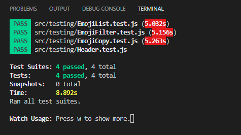

### 
## Açıklama

Emoji Search, kullanıcının emoji ifadelerini arayıp bulmasına olanak tanıyan bir React.js uygulamasıdır. Kullanıcılar arama çubuğuna bir kelime yazabilir veya bir emoji ifadesi seçerek diğer benzer emoji ifadelerini filtreleyebilirler.

Orijinal projenin kaynak kodlarına buradan erişebilirsiniz:
[Emoji Search](https://github.com/ahfarmer/emoji-search)

## Kurulum

Emoji Search projesini kullanmak için şunları yapmanız gerekir:

1. Bu uygulamayı yerel olarak çalıştırmak için, öncelikle bu projeyi kopyalayın veya indirin.
2. `npm install` komutunu çalıştırarak gerekli bağımlılıkları yükleyin.
3. `npm start` komutunu çalıştırarak konsol uygulamasını başlatın. Uygulama, [link](http://localhost:3000).adresinde çalışacaktır.
4. `npm test` komutu ile yazılmış test senaryolarını çalıştırabilirsiniz

## Testler

Emoji Search projesi için yazılan testler şunlardır:

- Header: Başlık kısmının başarılı bir şekilde render edildiğini kontrol edecek 
- EmojiList: Uygulama ilk açıldığında emoji listesinin başarılı bir şekilde render edildiğini kontrol eder.
- EmojiFilter: Bir filtreleme işlemi yapıldığında, emoji listesinin bu filtreye uygun şekilde yeniden render edildiğini kontrol eder.
- EmojiCopy:Liste üzerinden herhangi emojiye tıklandığında, ilgili emojinin kopyalandığını kontrol eder.
